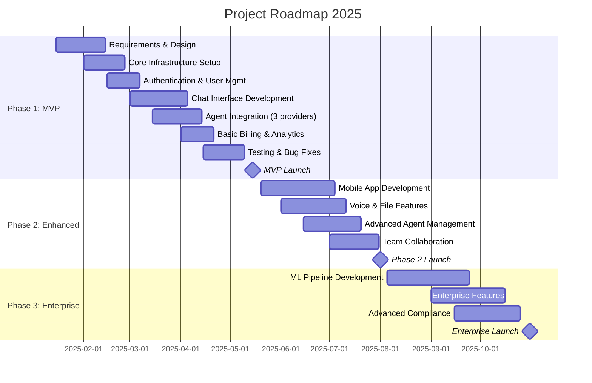

1. Executive Summary
2. Project Vision & Objectives
   - Business goals
   - Success metrics
3. Scope
   - In scope
   - Out of scope
   - Future considerations
4. Stakeholders & Roles
   - RACI matrix
5. Timeline & Milestones
   - High-level roadmap
   - Critical path
6. Budget & Resources
   - Team composition
   - Infrastructure costs
7. Assumptions & Constraints
8. Sign-off

# Project Charter: Multi-AI Agent Chat Platform

## Document Control

| Version | Date | Author | Changes |
|---------|------|--------|---------|
| 1.0 | 2025-01-30 | PM Team | Initial version |

---

## 1. Executive Summary

This project aims to develop a comprehensive AI chat platform that enables users to interact with multiple AI agents (GPT, Grok, Gemini, and custom-built agents) through web and mobile interfaces. The platform will support multi-modal inputs (text, voice, file uploads), provide robust project and conversation management through threads, and offer detailed analytics on usage and costs.

**Key Value Propositions:**
- **Unified Interface:** Single platform to access multiple AI providers
- **Extensibility:** Support for self-hosted and custom-trained agents
- **Enterprise-Ready:** Multi-tenant architecture with billing and compliance
- **Developer-Friendly:** Microservices architecture with comprehensive APIs

---

## 2. Project Vision & Objectives

### 2.1 Vision Statement

*"To become the leading platform for AI agent orchestration, enabling businesses and individuals to leverage multiple AI capabilities through a unified, scalable, and secure environment."*

### 2.2 Business Goals

1. **Market Entry:** Launch MVP within Q2 2025 targeting early adopters in tech and enterprise sectors
2. **User Acquisition:** Achieve 10,000 active users within 6 months post-launch
3. **Revenue:** Generate $500K ARR by end of Year 1 through subscription and usage-based pricing
4. **Technical Excellence:** Maintain 99.5% uptime SLA and <2s average response time

### 2.3 Success Metrics

| Category | Metric | Target | Measurement |
|----------|--------|--------|-------------|
| **User Engagement** | Daily Active Users (DAU) | 2,500 by Month 6 | Analytics dashboard |
| **Performance** | Average Response Time | <2 seconds | APM tools |
| **Reliability** | System Uptime | 99.5% | Monitoring alerts |
| **Quality** | Voice Transcription Accuracy | >90% | Automated testing |
| **Business** | Customer Acquisition Cost | <$50 | Marketing analytics |
| **Business** | Monthly Recurring Revenue | $40K by Month 6 | Billing system |

---

## 3. Scope

### 3.1 In Scope

**Phase 1: MVP (Q1-Q2 2025)**
- ✅ User authentication (Google, Facebook, Email/Phone)
- ✅ Web application (responsive design)
- ✅ Chat interface with 3 pre-integrated AI agents (GPT-4, Gemini Pro, Grok)
- ✅ Text input/output
- ✅ Thread-based conversation management
- ✅ Basic project management (CRUD operations)
- ✅ Agent configuration panel (API keys management)
- ✅ Basic billing tracking (token usage, cost estimation)
- ✅ User dashboard with usage statistics

**Phase 2: Enhanced Features (Q3 2025)**
- ✅ Mobile applications (iOS/Android)
- ✅ Voice input/output with transcription
- ✅ File upload support (PDF, TXT, images up to 10MB)
- ✅ Advanced agent management (versioning, Docker deployment)
- ✅ Detailed analytics and reporting
- ✅ Team collaboration features (project sharing, permissions)
- ✅ Self-hosted agent deployment capability

**Phase 3: Enterprise & ML (Q4 2025)**
- ✅ Custom agent training pipeline (Hugging Face integration)
- ✅ Advanced orchestration (agent chaining, workflows)
- ✅ Enterprise features (SSO, advanced RBAC, audit logs)
- ✅ White-label capability
- ✅ Advanced compliance features (data residency, encryption key management)

### 3.2 Out of Scope

- ❌ Native desktop applications (Windows/macOS/Linux)
- ❌ Video conferencing integration
- ❌ Blockchain/cryptocurrency payment integration
- ❌ Real-time collaborative document editing
- ❌ Built-in CRM or ticketing system
- ❌ Automated agent marketplace (planned for Year 2)

### 3.3 Future Considerations

- Agent marketplace for community-built agents
- Advanced ML operations (A/B testing for models)
- Multi-language support beyond English
- Integration with enterprise tools (Slack, Teams, Salesforce)
- Advanced analytics with predictive insights

---

## 4. Stakeholders & Roles

### 4.1 RACI Matrix

| Activity | Product Owner | Engineering Lead | DevOps Lead | Data Science Lead | QA Lead | Legal/Compliance | Finance |
|----------|--------------|------------------|-------------|-------------------|---------|-----------------|---------|
| **Requirements Definition** | A | C | I | C | I | C | I |
| **Architecture Design** | C | A | R | R | I | I | I |
| **Development** | I | A | R | R | R | I | I |
| **Infrastructure Setup** | I | C | A | I | I | I | I |
| **ML Pipeline Development** | I | C | R | A | I | I | I |
| **Testing & QA** | I | C | R | I | A | I | I |
| **Security Review** | I | R | R | I | C | A | I |
| **Deployment** | C | R | A | I | C | I | I |
| **Billing Implementation** | R | R | I | I | C | I | A |
| **Go-Live Approval** | A | C | C | I | C | R | R |

**Legend:** A = Accountable, R = Responsible, C = Consulted, I = Informed

### 4.2 Key Stakeholders

**Internal Team:**
- **Product Owner:** Sarah Chen - Final decision maker on features and priorities
- **Engineering Lead:** Michael Rodriguez - Technical architecture and development oversight
- **DevOps Lead:** James Kim - Infrastructure and deployment
- **Data Science Lead:** Dr. Emily Watson - ML pipeline and model integration
- **QA Lead:** Ahmed Hassan - Quality assurance and testing strategy
- **Security Officer:** Laura Bennett - Security compliance and audits
- **Finance Manager:** Robert Taylor - Billing, pricing, and financial tracking

**External Stakeholders:**
- **Early Access Customers:** Beta testing and feedback (20 selected companies)
- **AI Provider Partners:** OpenAI, Google, xAI - API integration support
- **Legal Advisors:** GDPR and data privacy compliance consultants
- **Investors:** Quarterly progress reports and demos

---

## 5. Timeline & Milestones

### 5.1 High-Level Roadmap

### 5.2 Critical Milestones

| Milestone | Date | Deliverables | Success Criteria |
|-----------|------|--------------|------------------|
| **M1: Project Kickoff** | 2025-01-15 | Charter approved, team assembled | All stakeholders signed off |
| **M2: Design Complete** | 2025-02-14 | Architecture, UI/UX mockups, API specs | Design review passed |
| **M3: Alpha Release** | 2025-04-01 | Internal testing version | Core features functional |
| **M4: Beta Release** | 2025-04-30 | Limited external release | 20 beta customers onboarded |
| **M5: MVP Launch** | 2025-05-15 | Public release (Phase 1) | Public availability, marketing launch |
| **M6: Mobile Apps** | 2025-07-15 | iOS/Android in stores | App store approval |
| **M7: Enterprise Ready** | 2025-10-31 | Full feature set | Enterprise customers signed |

### 5.3 Critical Path

**Dependencies:**
1. Authentication system → All user-facing features
2. Agent integration framework → Individual agent implementations
3. Thread management → Advanced conversation features
4. Billing infrastructure → Usage tracking and reporting
5. Infrastructure setup → All deployments

---

## 6. Budget & Resources

### 6.1 Team Composition

| Role | Headcount | Timeline | Notes |
|------|-----------|----------|-------|
| **Product Manager** | 1 FTE | Full project | Product Owner |
| **Backend Engineers** | 4 FTE | Full project | Microservices development |
| **Frontend Engineers** | 3 FTE | Full project | Web + Mobile |
| **DevOps Engineers** | 2 FTE | Full project | Infrastructure & CI/CD |
| **Data Scientists/ML Engineers** | 2 FTE | Phase 2-3 | ML pipeline & training |
| **QA Engineers** | 2 FTE | From Month 2 | Automated & manual testing |
| **UI/UX Designer** | 1 FTE | Phase 1-2 | Design system & user research |
| **Security Engineer** | 1 FTE (part-time) | Full project | Security audits & compliance |
| **Technical Writer** | 1 FTE (part-time) | Phase 2-3 | Documentation |

**Total Team Size:** 15-17 FTE

### 6.2 Infrastructure Costs (Monthly Estimates)

| Category | Provider | Estimated Cost | Notes |
|----------|----------|----------------|-------|
| **Compute** | AWS/GCP | $8,000 | Kubernetes cluster, auto-scaling |
| **Database** | Managed PostgreSQL | $2,500 | High availability setup |
| **Storage** | S3/Cloud Storage | $1,500 | Voice files, uploaded documents |
| **Message Queue** | Managed Kafka/RabbitMQ | $1,000 | Event streaming |
| **Monitoring** | Datadog/New Relic | $1,200 | APM, logs, metrics |
| **AI Provider APIs** | OpenAI, Google, xAI | $15,000 | Usage-based (pass-through to customers) |
| **CDN** | CloudFlare | $500 | Global content delivery |
| **Email/SMS** | SendGrid/Twilio | $400 | Notifications |
| **Security** | Security tools | $800 | WAF, DDoS protection |
| **CI/CD** | GitHub Actions/CircleCI | $300 | Build pipelines |
| **Total** | | **$31,200/month** | Scales with usage |

### 6.3 Total Budget Summary

| Category | Amount | Percentage |
|----------|--------|------------|
| **Personnel (10 months)** | $1,200,000 | 70% |
| **Infrastructure (10 months)** | $312,000 | 18% |
| **Software Licenses** | $50,000 | 3% |
| **Marketing & Sales** | $100,000 | 6% |
| **Legal & Compliance** | $30,000 | 2% |
| **Contingency (10%)** | $169,200 | 10% |
| **Total Project Budget** | **$1,861,200** | 100% |

---

## 7. Assumptions & Constraints

### 7.1 Assumptions

1. **AI Provider Availability:** OpenAI, Google, and xAI APIs remain accessible with current pricing
2. **Team Availability:** All key team members available as planned
3. **Third-Party Services:** OAuth providers (Google, Facebook, TikTok) maintain current integration methods
4. **Market Demand:** Sufficient market interest validates the MVP approach
5. **Regulatory Stability:** No major changes to GDPR/CCPA during project timeline
6. **Technology Maturity:** Chosen tech stack (Kubernetes, microservices) is production-ready
7. **Beta Participation:** 20 companies willing to participate in beta testing

### 7.2 Constraints

**Budget Constraints:**
- Total budget capped at $1.9M for initial launch
- Infrastructure costs must remain under $35K/month in Phase 1
- Must achieve unit economics by Month 12

**Timeline Constraints:**
- MVP must launch by Q2 2025 to capture market opportunity
- Mobile apps required by Q3 2025 for conference demonstrations
- Enterprise features needed by Q4 2025 for key customer commitments

**Technology Constraints:**
- Must use cloud-native architecture (AWS or GCP)
- Must support containerization (Docker/Kubernetes)
- Frontend must support browsers: Chrome 90+, Safari 14+, Firefox 88+, Edge 90+
- Mobile must support iOS 14+ and Android 10+

**Resource Constraints:**
- Limited to 17 FTE maximum
- DevOps team shared with other company projects (60% allocation)
- Data Science team available only from Phase 2

**Compliance Constraints:**
- Must comply with GDPR (European customers)
- Must comply with CCPA (California customers)
- Voice data must be encrypted at rest and in transit
- Data residency requirements for enterprise customers

**Performance Constraints:**
- Chat response time <2 seconds (95th percentile)
- Voice transcription <3 seconds for 30-second audio
- System must support 1,000 concurrent users in Phase 1
- API rate limiting: 100 requests/minute per user

---

## 8. Risk Assessment Summary

*Detailed risks covered in risk-management.md*

| Risk Category | Level | Key Mitigation |
|---------------|-------|----------------|
| **AI Provider Dependency** | HIGH | Multi-provider strategy, fallback mechanisms |
| **Data Privacy/Compliance** | HIGH | Legal review, encryption, audit trails |
| **Technical Complexity** | MEDIUM | Phased approach, proof-of-concepts |
| **Market Competition** | MEDIUM | Unique features, fast iteration |
| **Budget Overrun** | MEDIUM | Contingency fund, scope prioritization |
| **Team Turnover** | LOW | Knowledge sharing, documentation |

---

## 9. Project Governance

### 9.1 Decision-Making Process

**Level 1: Day-to-Day Decisions**
- Made by: Engineering leads
- Examples: Technical implementation choices, library selection
- Documentation: Technical ADRs

**Level 2: Tactical Decisions**
- Made by: Product Owner with engineering leads
- Examples: Feature prioritization, sprint planning
- Documentation: Sprint planning docs

**Level 3: Strategic Decisions**
- Made by: Steering committee (PO, Engineering Lead, CEO, Finance)
- Examples: Scope changes, budget reallocation, timeline adjustments
- Documentation: Steering committee meeting minutes

### 9.2 Communication Plan

| Audience | Frequency | Format | Owner |
|----------|-----------|--------|-------|
| **Engineering Team** | Daily | Standup (15 min) | Engineering Lead |
| **Full Team** | Weekly | Sprint planning/review | Product Owner |
| **Stakeholders** | Bi-weekly | Progress report | Product Owner |
| **Executives** | Monthly | Dashboard + presentation | Product Owner |
| **Customers (Beta)** | Monthly | Newsletter + feedback session | Product Manager |
| **Investors** | Quarterly | Formal report + demo | CEO |

### 9.3 Change Management

**Process for Scope Changes:**
1. Submit change request to Product Owner
2. Impact analysis (time, budget, resources)
3. Steering committee review and decision
4. Update project documents if approved
5. Communicate to all stakeholders

**Approval Thresholds:**
- <5% budget impact: Product Owner approval
- 5-10% budget impact: Steering committee approval
- >10% budget impact: Executive team + investor approval

---

## 10. Success Factors

### 10.1 Critical Success Factors

1. **Strong Technical Foundation:** Scalable microservices architecture from day one
2. **User-Centric Design:** Intuitive UI/UX validated through user testing
3. **AI Integration Quality:** Reliable, low-latency connections to AI providers
4. **Data Security:** Robust security measures passing third-party audits
5. **Team Collaboration:** Effective cross-functional teamwork
6. **Customer Feedback Loop:** Rapid iteration based on beta user feedback
7. **Financial Discipline:** Staying within budget while meeting milestones

### 10.2 Exit Criteria (Project Completion)

**Phase 1 Complete When:**
- ✅ All MVP features deployed to production
- ✅ 99.5% uptime achieved for 30 consecutive days
- ✅ 100 paying customers acquired
- ✅ Security audit passed
- ✅ Documentation complete
- ✅ Support team trained
- ✅ Post-launch review completed

---

## 11. Sign-off

By signing below, stakeholders acknowledge they have reviewed and approved this Project Charter.

| Name | Role | Signature | Date |
|------|------|-----------|------|
| Sarah Chen | Product Owner | ________________ | ________ |
| Michael Rodriguez | Engineering Lead | ________________ | ________ |
| James Kim | DevOps Lead | ________________ | ________ |
| Dr. Emily Watson | Data Science Lead | ________________ | ________ |
| Laura Bennett | Security Officer | ________________ | ________ |
| Robert Taylor | Finance Manager | ________________ | ________ |
| [CEO Name] | Executive Sponsor | ________________ | ________ |

---

## Appendix A: Acronyms

- **ADR:** Architecture Decision Record
- **APM:** Application Performance Monitoring
- **ARR:** Annual Recurring Revenue
- **DAU:** Daily Active Users
- **FTE:** Full-Time Equivalent
- **MVP:** Minimum Viable Product
- **RACI:** Responsible, Accountable, Consulted, Informed
- **RBAC:** Role-Based Access Control
- **SLA:** Service Level Agreement
- **SSO:** Single Sign-On

---

**Document Status:** APPROVED  
**Next Review Date:** 2025-04-01  
**Distribution:** All project stakeholders
