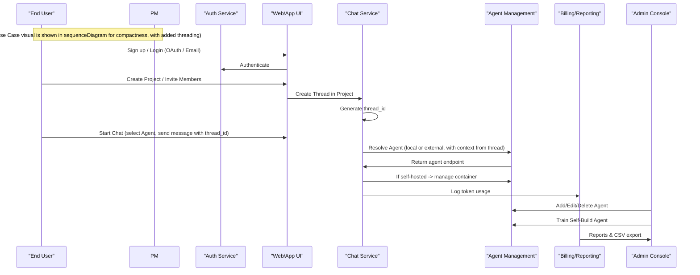
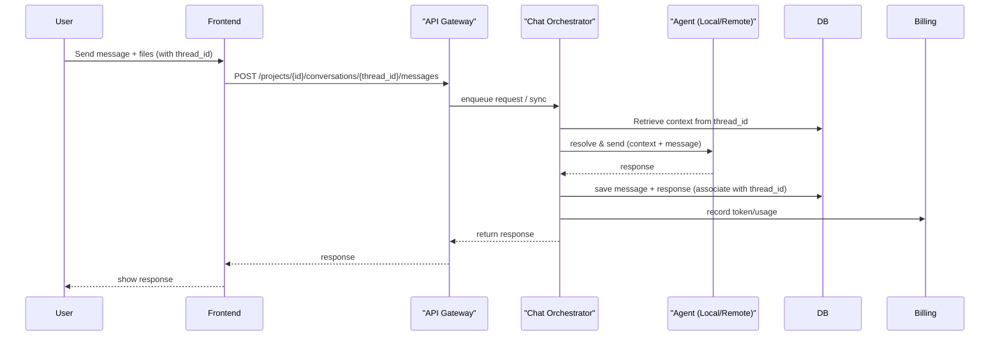
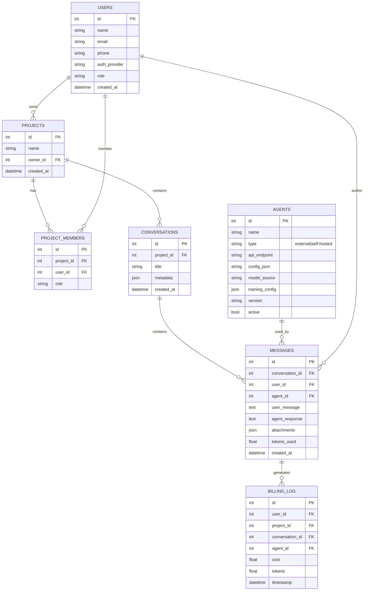

# 3) Use Case Diagram (Mermaid) — (BA / PO)



> lưu ý: trên thực tế Use Case thường là diagram UML; ở đây mình biểu diễn tương tác chính. Nếu bạn muốn file PlantUML/UseCase cụ thể mình xuất tiếp.

---

# 4) Context Diagram / System Boundary (Mermaid flowchart) — (System Analyst)

```mermaid
flowchart LR
    subgraph External
        U[User (Web/App)]
        OAuth[OAuth Providers (G, FB, TikTok)]
        ExtAI[External AI APIs (OpenAI, Grok, Gemini)]
        StorageSVC[File Storage (S3)]
        MLRepo[ML Repos (Hugging Face)]
    end

    subgraph System["ChatAI Platform"]
        Web[Web / Mobile Frontend]
        Auth[Auth Service]
        API[API Gateway / Backend]
        Chat[Chat Service / Orchestrator]
        AgentMgr[Agent Management Service]
        MLTrain[ML Training Service]
        DB[(Primary DB)]
        Billing[Billing & Reporting]
        DevOps[Deployment Manager (Docker)]
    end

    U --> Web
    Web --> API
    API --> Auth
    API --> Chat
    Chat --> AgentMgr
    AgentMgr --> DevOps
    AgentMgr --> ExtAI
    AgentMgr --> MLTrain
    MLTrain --> MLRepo
    API --> DB
    Chat --> StorageSVC
    Billing --> DB
    OAuth --> Auth
```

---

# 5) Activity / Workflow Diagram: “User Chat Flow” (Mermaid) — (BA/System Analyst)

```mermaid
flowchart TD
    A[User chọn Project] --> B[Chọn Agent]
    B --> C{Agent là self-hosted?}
    C -->|Yes| D[Test connection -> Deploy container nếu cần]
    C -->|No| E[Call external AI API]
    D --> F[Retrieve context from thread_id]
    E --> F
    F --> G[Send user message + context (files + thread history)]
    G --> H[Agent trả kết quả]
    H --> I[Save conversation to DB & index for search (with thread_id)]
    I --> J[Update billing & token usage]
    J --> K[Show response & options to user]
```

---

# 6) Sequence Diagram: “Send Message -> Agent -> Response” (Mermaid) — (System Analyst)



---

# 7) ERD sơ bộ (Mermaid ER) — (DBA / Data Engineer)



---

# 8) Component Diagram (Mermaid) — (Architect)

```mermaid
graph LR
    subgraph Frontend
        NextJS[Next.js Web/App]
        Mobile[Mobile App (React Native)]
    end

    subgraph Backend
        API[API Gateway]
        Auth[Auth Service]
        UserSvc[User & Project Service]
        ChatOrch[Chat Orchestrator]
        AgentMgr[Agent Management Service]
        MLTrain[ML Training Service (Python)]
        Billing[Reporting & Billing]
        FileSvc[File Service]
        DB[(Postgres)]
    end

    subgraph Infra
        Kubernetes[Kubernetes Cluster]
        Registry[Docker Registry]
        S3[S3 Compatible Storage]
        Redis[Redis Cache]
        Prometheus[Prometheus + Grafana]
    end

    NextJS --> API
    Mobile --> API
    API --> Auth
    API --> UserSvc
    API --> ChatOrch
    ChatOrch --> AgentMgr
    AgentMgr --> Registry
    AgentMgr --> Kubernetes
    AgentMgr --> MLTrain
    ChatOrch --> Redis
    ChatOrch --> FileSvc
    All[UserSvc,Billing,AgentMgr] --> DB
    Infra --> Prometheus
```

---

# 9) Deployment Diagram (Mermaid) — (DevOps)

```mermaid
flowchart LR
    subgraph Cloud
        AKS[K8s Cluster / EKS / GKE]
        LoadBalancer[LB / Ingress]
        ContainerRegistry[Docker Registry]
        ObjectStore[S3]
        GPUNodes[GPU Nodes for Training (Optional)]
    end

    User -->|HTTPS| LoadBalancer
    LoadBalancer --> API_GW_Pod[API Gateway Pod (K8s)]
    API_GW_Pod --> Auth_Pod
    API_GW_Pod --> Web_Pod
    API_GW_Pod --> ChatOrch_Pod
    ChatOrch_Pod --> AgentPod[Agent Containers (self-hosted) on Node]
    ChatOrch_Pod --> MLTrain_Pod[ML Training Pod]
    MLTrain_Pod --> GPUNodes
    AllPods --> Postgres_Pod
    FileUploads --> ObjectStore
    Metrics --> Prometheus
```
