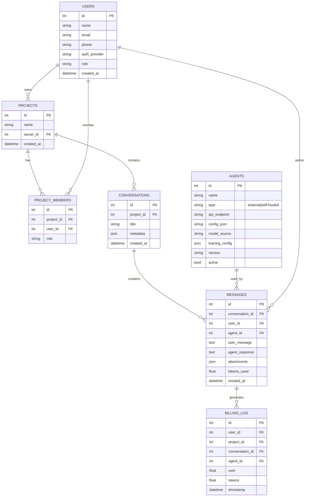

# 7) ERD sơ bộ (Mermaid ER) — (DBA / Data Engineer)

```mermaid
erDiagram
    USERS {
        int id PK
        string name
        string email
        string phone
        string auth_provider
        string role
        datetime created_at
    }
    PROJECTS {
        int id PK
        string name
        int owner_id FK
        datetime created_at
    }
    PROJECT_MEMBERS {
        int id PK
        int project_id FK
        int user_id FK
        string role
    }
    CONVERSATIONS {
        int id PK
        int project_id FK
        string title
        json metadata
        datetime created_at
    }
    AGENTS {
        int id PK
        string name
        string type  "external|self-hosted"
        string api_endpoint
        string config_json
        string model_source
        json training_config
        string version
        bool active
    }
    MESSAGES {
        int id PK
        int conversation_id FK
        int user_id FK
        int agent_id FK
        text user_message
        text agent_response
        json attachments
        float tokens_used
        datetime created_at
    }
    BILLING_LOG {
        int id PK
        int user_id FK
        int project_id FK
        int conversation_id FK
        int agent_id FK
        float cost
        float tokens
        datetime timestamp
    }

    USERS ||--o{ PROJECTS : owns
    PROJECTS ||--o{ PROJECT_MEMBERS : has
    USERS ||--o{ PROJECT_MEMBERS : member
    PROJECTS ||--o{ CONVERSATIONS : contains
    CONVERSATIONS ||--o{ MESSAGES : contains
    AGENTS ||--o{ MESSAGES : used_by
    USERS ||--o{ MESSAGES : author
    MESSAGES ||--o{ BILLING_LOG : generates
```
