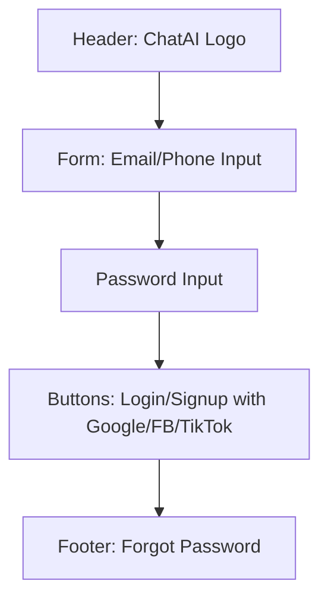
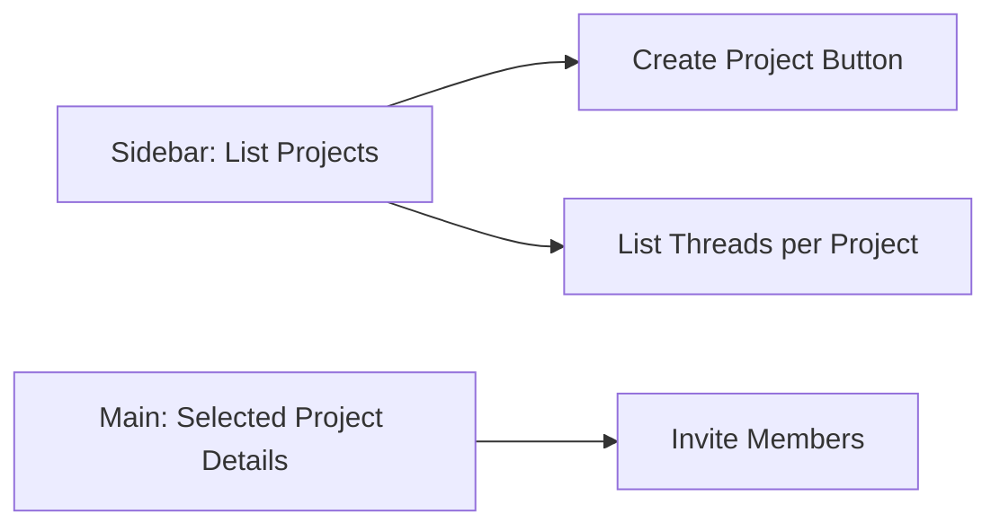
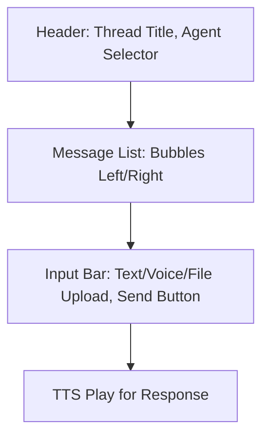

Mô tả text-based wireframes (e.g., "Route /chat: Giao diện chat với sidebar projects, chọn agent...")

### UI Wireframes Chi Tiết

Dưới đây là nội dung cho `UI-Wireframes.md`, dùng Mermaid cho text-based diagrams (dễ paste vào Mermaid viewer hoặc GitHub). Tôi mô tả web/mobile screens chính (login, projects, chat), với PlantUML-like syntax cho visual. Nếu cần Figma, bạn có thể import từ đây.

---

# UI Wireframes Cho ChatAI Platform

## 1. Overview
Wireframes cho web (Next.js) và mobile (React Native). Focus responsive (mobile-first). Screens: Login/Signup, Projects Dashboard, Chat Thread.

## 2. Login/Signup Screen
- Web: Full page form. Mobile: Centered card.  

Mermaid diagram (copy to Mermaid viewer):  

Text description:  
- Layout: Vertical center, inputs with labels, social buttons below. Error message red if invalid.  

## 3. Projects Dashboard
- Web: Sidebar left for projects/threads. Mobile: Bottom nav.  

Mermaid:  

Text:  
- Sidebar: Collapsible on mobile. List with icons, search bar for threads.  

## 4. Chat Thread Screen
- Web: Full height chat box. Mobile: Keyboard aware.  

Mermaid:  

Text:  
- Message bubbles: User right, AI left, with timestamp. Input: Icons for voice/file. TTS button on AI messages.

Full Figma prototype: [Link placeholder - bạn tạo Figma từ diagrams này].

---
